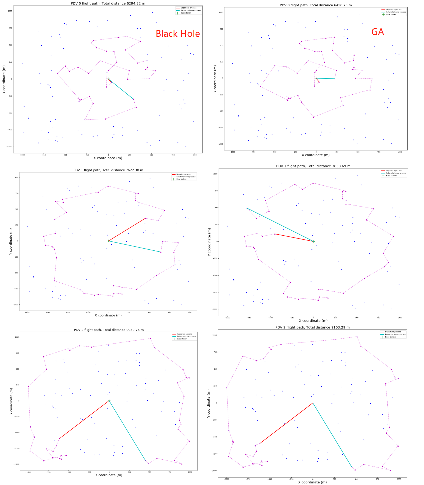
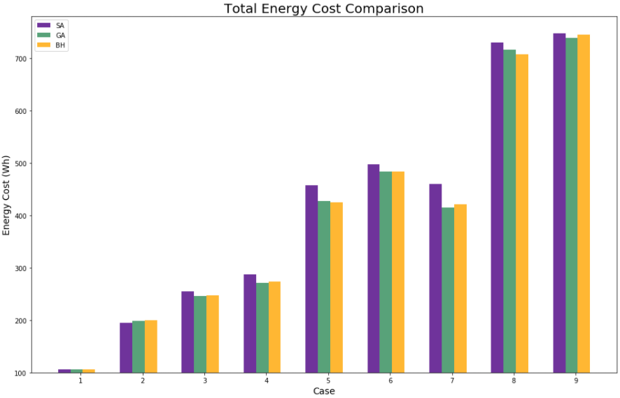
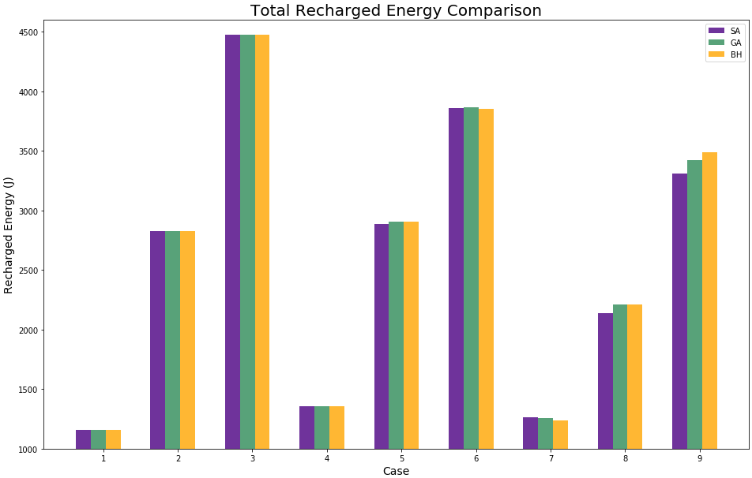
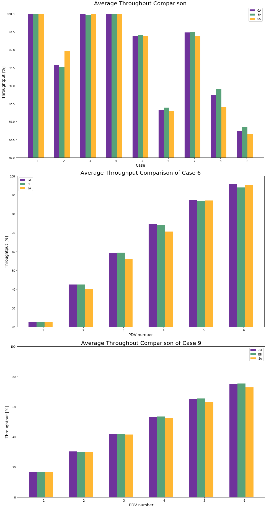

# Optimal Drone Recharging Scheduling for Wireless Sensor Power Transfer and Data Collection
This project aims at solving Optimization Problem in scheduling recharing tasks for Unmanned Aerial Vehicles (UAVs) under the Wireless Rechargeable Sensor Network. 


---

## Quick Start with console user interface
1. Create empty folder structure:
```
	|---- project/
	|-------- input/
	|------------ initial_guess/
	|-------- output/
	|------------ sub_path/
	|-------- sys/
```
2. Open MSVC 2019 -> `Create a new project` -> `Empty Project` -> select `Location` at `sys/`
3. Place your input file (.csv) in `input/` folder and [source code](Code/ensemble_system) in `sys/` folder
4. Open `Solution Explorer` in MSVC, `Add` -> `Existing Item` all files (.h) to `Header Files` 
5. `Add` -> `Existing Item` all files (.cpp) to `Source Files`
6. In `Solution Explorer`, open `Properties` of `sys`
7. In `General`, set `C++ Language Standard` to `ISO C++17 Standard (std:c++17)`
8. In `C/C++`, set `SDL checks` to `No (/sdl-)`
9. `Bulid` -> `Bulid sys` (or `Ctrl+B`)
10. Run the executable file (.exe)

---

## Brief Index
- Source code can be found in [Code directory](Code).
- Example input and output files are stored in [input](input) and [output](output).
- Documentation of C++ code can be found in [Documentation directory](Code/Documentation).
- Experimental results achieved by author team can be found in [Result directory](Result).
- Visualization of complete flight paths can be found in [VisualResult directory](Result/VisualResult).
- Final report can be found in [FinalReport directory](FinalReport).
- DEMO figures used for readme files can be found in [Figure directory](Figure).

## Code Documentation
Documentation files are generated through [Doxygen](https://www.doxygen.nl/index.html). Through index file [ga_index](Code/Documentation/ga_doc/ga_index.lnk), [bh_index](Code/Documentation/bh_doc/bh_index.lnk) and [sa_index](Code/Documentation/sa_doc/sa_index.lnk), users can check the code structure, function usage, variable definitions, etc. If content of the index file cannot display properly, please check corresponding source file `index.lnk` in `html\` directory.

## Model Selection
Please note that the original system model is based on [the research of A. Y. S. Pandiyan et al](https://www.researchgate.net/publication/341077461_Optimal_Energy_Management_of_Two_Stage_Energy_Distribution_Systems_Using_Clustering_Algorithm). However, this project made several modifications to make the system model more practical. More details can be found in related paper and [introduction of model comparison](Model_Comparison.pdf). **Quick Start with console user interface** section adopts *original* model. Other sections will adopt *new* model. Note that in the paper, the system model adopts the original one. More technical descriptions can be found in the paper.

---

## Folder Structure
Due to different file names, the following folder structure are ***strongly recommended*** before implmenting all codes. *Otherwise, users are required to change default file directory in the codes!*

The structure of directory to store code and input/output data should be: (Take implementing [GA](Code/iterated_GA) as an example)

```
	|---- project/
	|-------- input/
	|------------ inputs.csv
	|------------ sub_path0.csv
	|------------ sub_path1.csv
	|------------ ...
	|------------ initial_guess/
	|----------------- pop0_pdv0.txt
	|----------------- pop0_pdv1.txt
	|----------------- pop1_pdv0.txt
	|----------------- ...
	|-------- output/
	|------------ final_info.csv
	|------------ final_output.csv
	|------------ sub_path/
	|----------------- ga_path0.csv
	|----------------- ga_path1.csv
	|----------------- ...
	|-------- algorithm/
	|------------ 1_data_generation.ipynb
	|------------ 3_result_visualization.ipynb
	|------------ genetic.cpp
	|------------ genetic.h
	|------------ main.cpp
	|------------ pdv.cpp
	|------------ ...
```

- The above structure includes all possible files. In pratice, some files may not exist! For example, if users want to re-implement GA, then `sub_path0.csv` in `input\` directory is not needed.

- Both `.ipynb` file should be placed under the same directory with C++ header and source files. 

- Modifications of dierctory name or location are **NOT** recommanded. Please check algorithm I/O functions and I/O parameters in two `.ipynb` files if modifications are needed!

- Because there are 3 algorithms, the output file names are different (i.e. `ga_path0.csv`, `bh_path0.csv`, etc.). Users may need to modify string names according to the algorithm name.      

## Integrated system with user interface
All algorithms and system model are integrated within one project. Users can use that system with following steps:
1. Use MSVC to build and run [source code](Code/ensemble_system).
2. Enter commands in the console terminal (following given instructions).

## User Guidance
This project adopted [MSVC 2019](https://visualstudio.microsoft.com/zh-hans/vs/) and C++17 language standard for the simulation.  
*!!! WARNING !!! Lower language standard may lead to build errors. Please check your compiler and its version!* 

### A NAIVE SOLUTION (OPTIONAL): Scikit-learn Clustering Method + Shortest Next Job (SJN) as Baseline
The [data generation file](Code/1_data_generation.ipynb) also supports some typical clustering algorithms (i.e. K-Means, Spectral and Agglomerative Clustering) with scikit-learn library. The sub path file (i.e. [sub_path0.csv](Code/input/sub_path0.csv)) will be generated at `input/` directory for further usage. Then code in [pdv simulation](Code/pdv_simulation) is designed for recharging simulation of this situation.

*Quick Start for Clustering + SJN*: 
1. Implement *1. Input data generation* (**INCLUDING OPTIONAL STEP**).

    The data format of output sub path file: 
    ```
        x_pos           y_pos
        -672.08	    -193.15
        -371.66	    76
        -980.82	    -661
    ```
    *!!! NOTICE !!! The output file will be placed in `input/` directory*

2. Create a new project with MSVC and add all needed header and source files in [pdv_simulation](Code/pdv_simulation).
3. Open `C/C++`, set `SDL checks` to `No (/sdl-)`.
4. Match the marco `NODE_NUM` and `PDV_NUM` in [main.cpp of pdv_simulation](Code/pdv_simulation/main.cpp) with the number of sensor nodes.
5. Set wanted minimum charge number for single PDV.
6. Build and run the code.
7. Find recharging summary in `output/` directory.

***Clustering Results Comparison DEMO*** <br/>


### A NOVEL SOLUTION: Generate Solutions with Optimization Algorithms
Users can solve the drone recharging scheduling problem with provided optimization algorithms as well (Genetic, Black Hole, Simulated Annealing Algorithm). But users are strongly recommended to clear all input and output files (but remain folder structure). Please note that there are three main parts of the project. The instructions of executing them can be found as below (*please check [tips for users](Code/README.md) in advance as well*):

#### Step 1. Input data generation
Python is used to generate CSV file of input data. In [data generation file](Code/1_data_generation.ipynb), users can change the variable `sensor_node_num` to automatically generate specific number of sensor nodes. There are many other hyper-paramters like `p_v_max` (set maximum voltage level), `scale_x_max` (set the maximum value of x axis), etc. Plese see comments in [data generation file](Code/1_data_generation.ipynb) for more details!

**OR** directly modify [inputs.csv](Code/input/inputs.csv) with below format:

```
    x_pos	y_pos	p_flag	   volts	   weights
    4851	16711	  0	    2.010605073	     9
    26894	110695	  1	    3.002501137	     3
    117004	50480	  0	    1.966313626	     8
```

*!!! NOTICE !!! The system allow users to manually input information of sensors but the format should be same with above `.csv` file*

#### Step 2. Calculate the optimal solution with GA, BH or SA with SJN strategy
Before executing optimization algorithm codes, users can tune hyper-parameters according to specific requirements, which are defined at the top of [genetic.cpp](Code/iterated_GA/genetic.cpp), [blackhole.cpp](Code/iterated_BH/blackhole.cpp) and [annealing.cpp](Code/iterated_SA/annealing.cpp). For example, in `genetic.cpp`, changing `cr` to 60 can reduce the possibility of crossover. Or changing `init_temp` to 1.3e3 can increase iterations. Please check related comments or documentations for more details! 

*Quick Start for Optimization Algorithms*: (Here take GA as an example)
1. Empty all input and output files but remain folder structure.
2. Implement *1. Input data generation* (**EXCLUDE OPTIONAL STEP**).
3. Create a new project with MSVC and add all needed header and source files in [iterated_GA](Code/iterated_GA).
4. Open `Configuration Properties`, set `C++ Language Standard` to `ISO C++17 Standard (std:c++17)`.
5. Open `C/C++`, set `SDL checks` to `No (/sdl-)`.   
6. Set wannted hyper-parameters and change the marco `NODE_NUM` in `main.cpp` to correct number.
7. Build and run the code.
8. Find recharging summary (two CSV files) in `output/` directory. (If there exists output files due to other algorithm execution, former results will be ***covered***.)

***Optimization Algorithm Results Comparison DEMO*** <br/>


#### Step 3. Result visualization
Visualization can be done using generated sub path files in `output/` directory (i.e. [bh_path0.csv](Code/output/sub_path/bh_path0.csv)). Please check comments in [visualization code](Code/3_result_visualization.ipynb) for more information! Visualized experimental results by author team can be found in [VisualResult directory](Result/VisualResult). Note that for the final step (histogram generation), the code needs a file called [ensemble_output.csv](Code/output/ensemble_output.csv), which is the summary of algorithms under different scenarios.

***Complete Flight Path DEMO*** <br/>


To better visualize summary of results, histograms can be generated as well in [visualization code](Code/3_result_visualization.ipynb).

***Summary of Total PDV Energy Cost DEMO*** <br/>


***Summary of Total Recharged Energy DEMO*** <br/>


Note that the `Case` (x-axis) here means tested 9 scenarios (different scales of networks). Details are stated in the report.

---

## Complementary experiments
1. To explore the impact of required number of PDVs to average throughput, we also did several complementary experiments with increasing number of assigned PDVs. Below 3 figures show the experiment result:

	

	The first figure is execution summary of all cases. For the case with the lowest average throughput (6 & 9), we can observe that assigning 6 PDVs to case 6 is the most efficient. For case 9, it may take 7 or even 8 PDVs to achieve the highest efficiency.

2. To explore the impact of SA iterations, we also reduced the computational cost. Visualized results can be found in [SA_less_iters}(Result/SA_less_iters) directory.

## Execution time of algorithms
The execution time of the optimization algorithm is counted through `std::chrono::high_resolution_clock` (unit: ms). The time counter starts after calculation of inital guesses and ends when finding the solution with best fitness metric. The duration time will be recorded to [final_info.csv](Code/output/final_info.csv) as well (`alg_time`).

## Verification of code
This project adopts the [Unit Test tool of Miscrosoft](https://docs.microsoft.com/en-us/visualstudio/test/unit-test-your-code?view=vs-2019) to verify code implementations. We provide [sample code](Code/unit_test/unit_test.cpp) to test algorithm module and system model. Please check [the tutorial from Miscrosoft Doc](https://docs.microsoft.com/en-us/visualstudio/test/getting-started-with-unit-testing?view=vs-2019) to run tests correctly. Notice that:

- Because all included optimization algorithms share similar system model, in this case, author team only tested functionality of Genetic Algorithm and system model as the main example.
- Because random number wil be used in all included optimization algorithms, small errors will be allowed in some particular tests (i.e. error = 5 when involving random number). Normally, if there is no random variable, the allowed tolerance should be 1e-10.

*Quick Start for test code*: (Here take GA sample test as an example)
1. Create a new project with MSVC and add all needed header and source files in [iterated_GA](Code/iterated_GA).
2. Open `Solution Explorer` -> right click the first line `Solution 'xx'(your solution name)` -> `Add` -> `New Project` -> Select `Native Unit Test Project`.
3. Add test code to source files (Note that MSCV may have self-loading `pch.h` and `pch.cpp`, which were not used in the sample test code)
4. Include correct `.h` and `.cpp` at the top of test code
5. In your test project -> right click `References` -> `Add Reference` -> You should see the project (`iterated_GA` in this case) in the list -> select it -> click `OK`.
6. Build all solutions.
7. Run all tests in `Test Explorer`.

## Further Updates
Please note that this is a open-source project with continus updates. Currently, we consider the next step to:

1. Develop an IDE
2. Convert to 3D space
3. Consider parallel computing of all algorithms

## Other Information
Presentation slides can be seen [here](irp_presentation.pptx).

Author: 
- Qiuchen Qian - qiuchen.qian19@imperial.ac.uk
- Akshayaa Pandiyan - a.pandiyan@imperial.ac.uk
- David Boyle - david.boyle@imperial.ac.uk
    
